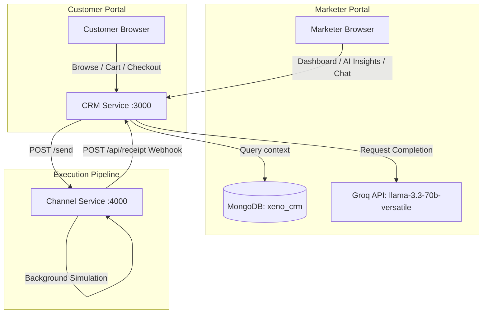

# Xeno AI-Native Mini CRM

An AI-Native Customer Relationship Management (CRM) and Campaign Automation platform. The system is split into two microservices: a CRM service representing store checkouts and marketer dashboards, and a simulated channel service simulating message deliveries.

---

## 1. Architecture Diagram



---

## 2. Project Setup & Local Running

### Prerequisites
- Node.js (v18+)
- MongoDB running locally on standard port `27017`

### Step 1: Environment Variables
Create `.env` files in both directories.

**`crm-service/.env`**:
```ini
PORT=3000
MONGODB_URI=mongodb://localhost:27017/xeno_crm
JWT_SECRET=supersecretjwtkeyforxenocrm
GROQ_API_KEY=your_groq_api_key_here
CHANNEL_SERVICE_URL=http://localhost:4000
```

**`channel-service/.env`**:
```ini
PORT=4000
CRM_CALLBACK_URL=http://localhost:3000/api/receipt
```

---

### Step 2: Install Dependencies & Seed Database
From the root directory, run:
```bash
# Install root seeder dependencies
npm install

# Run database seeder
node crm-service/seed.js
```
This populates MongoDB with:
- 1,000 customers (realistic Indian names)
- 5,000 orders spanning the past year
- Pre-calculated segment classifications
- Marketer profile `marketer@xeno.com` (password: `password123`)

---

### Step 3: Run the Services
Run each service in separate terminal windows.

**Start CRM Service**:
```bash
cd crm-service
npm start
```
Starts on [http://localhost:3000/](http://localhost:3000/)

**Start Channel Service**:
```bash
cd channel-service
npm start
```
Starts on [http://localhost:4000/](http://localhost:4000/)

---

## 3. API Documentation

### CRM Service API Endpoints

#### Authentication
- `POST /api/auth/register` (Customer registration)
- `POST /api/auth/login` (Authentication, returns JWT)

#### Shop & Checkout
- `GET /api/products` (Browse products)
- `GET /api/cart` (Get active shopping cart)
- `POST /api/cart` (Update cart quantities)
- `POST /api/orders` (Proceed checkout, triggers segment recalculations)
- `GET /api/orders` (My order history)

#### Marketer Portal
- `GET /api/analytics/dashboard` (KPIs & Chart.js data)
- `GET /api/segments` (Calculated segments list)
- `GET /api/segments/:name/customers` (Get segment customer users)
- `GET /api/ai/insights` (Gemini/Groq Segment recommendations)
- `POST /api/ai/generate-campaign` (Draft campaign from business goal)
- `POST /api/ai/copilot` (Chatbot query with CRM context)
- `POST /api/campaigns` (Create draft campaign)
- `POST /api/campaigns/:id/execute` (Dispatch campaigns to simulator)
- `POST /api/receipt` (Simulated delivery status webhook callback)

---

## 4. Deployment Instructions (Railway)

1. Create a **New Project** on Railway.
2. Add a **MongoDB** database instance.
3. Deploy `crm-service` as a web service:
   - Build Command: `npm install`
   - Start Command: `npm start`
   - Bind Environment Variables: `PORT`, `MONGODB_URI`, `JWT_SECRET`, `GROQ_API_KEY`, `CHANNEL_SERVICE_URL`.
4. Deploy `channel-service` as a web service:
   - Build Command: `npm install`
   - Start Command: `npm start`
   - Bind Environment Variables: `PORT`, `CRM_CALLBACK_URL` (points to the CRM service host).
5. Open the CRM URL to access the platform switcher.
